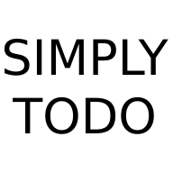

<div>
  <a href="https://github.com/pwlamidy/simply-todo">
    
  </a>

  <h3>A simple Todo app</h3>

  <p>
    To be used on mobile, with extra features like batch complete/delete todo and calendar view.
    <!-- <br />
    <br />
    <a href="http://13.57.211.62">View Demo</a> -->
  </p>
</div>

<!-- ABOUT THE PROJECT -->
## About The Project

<p>This project is built for demonstration and still under development.</p>

<!-- [![Product Name Screen Shot][product-screenshot]](http://13.57.211.62) -->


### Built With
[![React][React.js]][React-url]


<!-- GETTING STARTED -->
## Getting Started

This project can be set up with the following steps:

### Prerequisites

* A working backend. See [here](https://github.com/pwlamidy/simply-todo-backend)

* npm
  ```sh
  npm install npm@latest -g
  ```

### Installation

1. Clone the repo
   ```sh
   git clone https://github.com/pwlamidy/simply-todo.git
   ```
2. Go to project folder
   ```sh
   cd simply-todo
   ```
3. Install NPM packages
   ```sh
   npm install
   ```
4. Start server
   ```sh
   npm start
   ```


<!-- ROADMAP -->
## Roadmap

- [ ] Progressive Web App (PWA)
- [ ] Notification


<!-- CONTACT -->
## Contact

Idy Lam - puiwalam09@gmail.com

Project Link: [https://github.com/pwlamidy/simply-todo](https://github.com/pwlamidy/simply-todo)


<!-- MARKDOWN LINKS & IMAGES -->
[product-screenshot]: images/todo_sample.gif
[React.js]: https://img.shields.io/badge/React-20232A?style=for-the-badge&logo=react&logoColor=61DAFB
[React-url]: https://reactjs.org/
